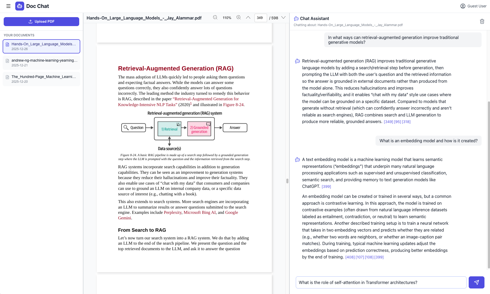

# Doc Chat

Doc Chat lets you talk to your PDF documents. It uses retrieval-augmented
generation (RAG) to find relevant pages and answer your questions about the
files you uploaded.



## Table of Contents
- [Description](#description)
- [How to run the project locally](#how-to-run-the-project-locally)
  - [API backend](#api-backend)
  - [Frontend](#frontend)

## Description
* Doc Chat is a RAG (Retrieval-Augmented Generation) application that allows
  users to chat with PDF documents.
* It uses ChromaDB to store the documents in the backend and perform vector
  search.
* For the frontend a React client is used.
* For answer generation, GPT-4o-mini is used.
* The answer includes references to the specific PDF pages used. Users can
  click the references to jump directly to those pages.
* Users can upload and store multiple documents.
* Currently, only guest mode using a browser cookie is supported.
* This means that if a user switches browsers, their data will not be
  available.
* Signup/login functionality will be added later.

## How to run the project locally

### API backend

```bash
cd api
```

Add a `.env` file in within the api folder with the following content:
```
OPENAI_API_KEY=<your-openai-api-key>
LANGSMITH_TRACING=true
LANGSMITH_ENDPOINT=https://api.smith.langchain.com
LANGSMITH_API_KEY=<your-langsmith-api-key>
LANGSMITH_PROJECT=doc-chat
GUEST_SIGNING_SECRET=<the-secret-key-for-guest-authentication>
UPLOAD_FOLDER=/tmp/doc-chat/uploads
CHROMA_TMP_DIR=/tmp/doc-chat/chroma
```

Create the virtual environment and install the dependencies:
```bash
python -m venv venv
source venv/bin/activat
pip install -r requirements.txt
pip install -e .
```

Start the server by running the following command:
```bash
 uvicorn doc_chat.main:app --reload
```

- Redoc will be available at `http://127.0.0.1:8000/redoc`
- Swagger UI will be available at `http://127.0.0.1:8000/docs`


Run the tests by running the following command:
```bash
pytest
```

### Frontend

Build and run the frontend by running the following commands:

```bash
cd client
npm install
npm start
```

Run the tests by running the following command:
```bash
npm test
```