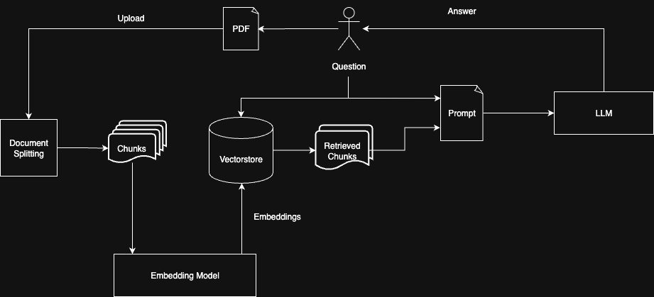

# Doc Chat

<!-- TOC -->
* [Doc Chat](#doc-chat)
  * [Description](#description)
  * [How It Works](#how-it-works)
  * [How to run the project locally](#how-to-run-the-project-locally)
    * [API backend](#api-backend)
    * [Frontend](#frontend)
<!-- TOC -->

## Description

Doc Chat is an AI-powered application that lets users interact with their PDF documents through a conversational interface.

- Ask questions about the content of your uploaded PDFs and receive accurate, context-aware answers.
- Each answer includes clickable references to the specific pages in the document where the information was found.
- Upload and store multiple PDF documents — files are saved securely in the backend for later use.
- Sessions are currently tied to your browser using a cookie — no login is required.
- Please note: switching browsers or clearing cookies will result in loss of access to your uploaded documents.
- A full user account system with persistent access across devices is planned for future releases.

Screenshot:


## How It Works

The diagram below illustrates the internal workflow of:



1. **PDF Upload**  
   Users upload one or more PDF documents via the UI. The PDFs are sent to the backend for processing and storage.

2. **Document Splitting**  
   Each PDF is split into pages, and each page is further divided into smaller, semantically meaningful chunks.  
   This is currently done using the [RecursiveCharacterTextSplitter](https://python.langchain.com/api_reference/text_splitters/character/langchain_text_splitters.character.RecursiveCharacterTextSplitter.html) from Langchain, which attempts to preserve the document structure by splitting at paragraph or sentence boundaries when possible.

3. **Embedding Generation**  
   Each chunk is converted into a vector representation (embedding) using the OpenAI Embedding API. These embeddings capture the semantic meaning of the chunk.

4. **Vector Storage**  
   The embeddings are stored in a [ChromaDB](https://www.trychroma.com/) vector store, which enables semantic similarity search.

5. **Question Embedding and Semantic Retrieval**  
   When the user asks a question, it is also converted into an embedding using the same model. A similarity search is performed in the vector store, and the top *k* most relevant chunks are retrieved based on the semantic similarity between the question and the stored chunks.

6. **Prompt Construction and LLM Query**  
   The retrieved chunks are bundled with the user’s question into a prompt, which is then sent to a language model (currently GPT-4o-mini). The prompt instructs the LLM to answer only based on the provided chunks, not from its own pre-trained knowledge.

7. **Answer Generation with References**  
   The LLM responds with an answer grounded in the document content and includes references to the original PDF pages. These references are clickable in the UI, allowing users to jump directly to the cited locations.

## How to run the project locally

### API backend

```bash
cd api
```

Add a `.env` file in within the api folder with the following content:
```
OPENAI_API_KEY=<your-openai-api-key>
LANGSMITH_TRACING=true
LANGSMITH_ENDPOINT=https://api.smith.langchain.com
LANGSMITH_API_KEY=<your-langsmith-api-key>
LANGSMITH_PROJECT=doc-chat
GUEST_SIGNING_SECRET=<the-secret-key-for-guest-authentication>
UPLOAD_FOLDER=/tmp/doc-chat/uploads
CHROMA_TMP_DIR=/tmp/doc-chat/chroma
```

Create the virtual environment and install the dependencies:
```bash
python -m venv venv
source venv/bin/activat
pip install -r requirements.txt
pip install -e .
```

Start the server by running the following command:
```bash
 uvicorn doc_chat.main:app --reload
```

- Redoc will be available at `http://127.0.0.1:8000/redoc`
- Swagger UI will be available at `http://127.0.0.1:8000/docs`


Run the tests by running the following command:
```bash
pytest
```

### Frontend

Build and run the frontend by running the following commands:

```bash
cd client
npm install
npm start
```

Run the tests by running the following command:
```bash
npm test
```